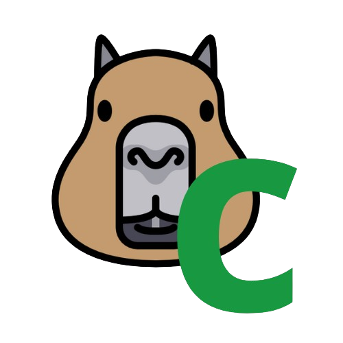

# QApivara

<div align="center">
    
</div>


**QApivara** é uma ferramenta inovadora desenvolvida para apoiar a **garantia de qualidade de software para sistemas embarcados**. Projetada com uma arquitetura robusta e tecnologias de ponta, o QApivara oferece recursos avançados para análise estática de código, verificação de conformidade e geração de matrizes de dependência.

## 🚀 Funcionalidades

- **Geração de Matriz de Dependência Estrutural**  
  Simula uma abordagem orientada a objetos para códigos C, visualizando dependências entre arquivos e funções.

- **Verificação de Conformidade de Padrões de Nomenclatura**  
  Valida automaticamente nomes de variáveis, funções e outras estruturas para garantir consistência e clareza no código.

- **Conformidade com Padrões de Qualidade (MISRA-C)**  
  Analisa o código para verificar aderência a padrões reconhecidos na indústria de sistemas embarcados.

- **Edição e Criação de Regras de Nomenclatura via YAML**  
  Permite criar ou editar regras diretamente na interface gráfica, salvando-as em arquivos YAML.

- **Interface Gráfica Intuitiva**  
  Desenvolvida com Qt, a interface é amigável, responsiva e facilita a interação com os módulos do sistema.

## 🛠️ Tecnologias Utilizadas

- **C++**  
  Linguagem principal do projeto, escolhida pela eficiência e flexibilidade.

- **Qt Framework**  
  Usado para o desenvolvimento da interface gráfica, garantindo suporte multiplataforma.

- **API do Clang/LLVM**  
  Base para as análises de código, oferecendo acesso direto à estrutura sintática e semântica.

- **CMake**  
  Gerenciador de construção modular, garantindo portabilidade e facilidade no gerenciamento de dependências.

## 📁 Estrutura do Projeto

```plaintext
QApivara
├── ComplianceModule
│   ├── ComplianceChecker.cpp
│   ├── ComplianceChecker.h
│   ├── ComplianceHandle.cpp
│   ├── ComplianceHandle.h
│   └── default_compliance.yaml
│    
├── DSMatrizModule
│   ├── DSMatrizModule.cpp
│   ├── DSMatrizModule.h
│   ├── DSMatrizModuleSample.cpp
│   └── DSMatrizModuleSample.h
│    
├── SafetyAnalyzer
│   ├── SafetyAnalyzer.cpp
│   └── SafetyAnalyzer.h
│    
├── test
│   ├── sample_driver.c
│   ├── second_driver.c
│   ├── teste.c
│   ├── 
│   ├── include
│   │   ├── sample_driver.h
│   │   └── second_driver.h
│   │    
│   ├── sub_module
│       ├── sub_module_sample.c
│       └── sub_module_sample.h
│        
└── UI
    ├── ComplianceGrid.cpp
    ├── ComplianceGrid.h
    ├── HomeTab.cpp
    ├── HomeTab.h
    ├── MainWindow.cpp
    ├── MainWindow.h
    ├── 
    └── Resources
        ├── ConfigIcon.png
        ├── DSMicon.png
        ├── logo.png
        ├── OpenIcon.png
        ├── Resources.cpp
        └── Resources.h
```

## 💻 Instalação

### Requisitos
Certifique-se de ter as seguintes ferramentas instaladas:
- GCC ou Clang
- Qt Framework
- CMake
- Bibliotecas do LLVM/Clang

### Passos de Instalação

1. Clone este repositório:

   ```bash
   git clone https://github.com/seu-usuario/QApivara.git
   cd QApivara
   ```

2. Crie um diretório de build e configure o projeto com o CMake:

   ```bash
   mkdir build
   cd build
   cmake ..
   ```

3. Compile o projeto:

   ```bash
   make
   ```

4. Execute o QApivara:

   ```bash
   ./QApivara
   ```

## 📝 Uso

1. **Análise de Código**  
   Carregue o projeto na interface gráfica e selecione os módulos de análise desejados: Matriz de Dependência, Compliance com MISRA-C, etc.

2. **Configuração de Regras de Nomenclatura**  
   Use a interface para criar ou editar arquivos YAML, estabelecendo regras personalizadas para o projeto.

3. **Testes de Conformidade**  
   Visualize relatórios detalhados sobre violações de regras ou padrões.

## 🛡️ Licença

Este projeto é licenciado sob a Licença MIT. Veja o arquivo [LICENSE](LICENSE) para mais detalhes.

---

Desenvolvido com 💙 pela equipe QApivara.
